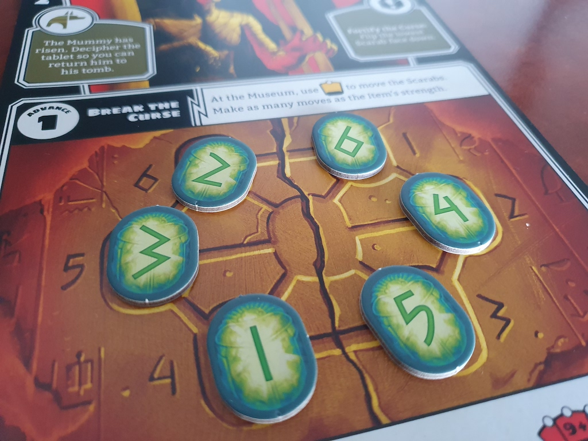

[Horrified](https://www.ravensburger.us/discover/games/horrified-game/index.html) is a
co-operative board game. When you're trying to defeat "The Mummy", one of your tasks is
to solve a sliding tile puzzle.

To me, it looked like an advent-of-code puzzle.



The script is deeply un-fancy, it literally generates the *entire* possible state space
of the board, and finds the shortest solution for every starting configuration.

To solve an arbitrary configuration, pass in the configuration as a single argument,
use `0` to represent the empty space, start in the center and then go in numerical order.

For example, the configuration in the attached photo is `0645132`:

```
$ python horrified-mummy-puzzle.py 0645132
(0, 6, 4, 5, 1, 3, 2) solved in 12 moves: ['1', '5', '4', '1', '3', '5', '4', '3', '2', '6', '1', '2']
```

Running it without arguments gives you the solutions to every valid starting puzzle:

```
$ python horrified-mummy-puzzle.py
(0, 4, 5, 6, 1, 2, 3) solved in 15 moves: 1  6  5  4  1  2  6  5  4  2  3  6  5  4  3
(0, 4, 5, 6, 1, 3, 2) solved in 14 moves: 5  6  1  3  5  4  6  1  3  4  2  6  1  2
(0, 4, 5, 6, 2, 1, 3) solved in 14 moves: 4  5  6  2  4  3  5  6  2  3  1  5  6  1
(0, 4, 5, 6, 2, 3, 1) solved in 13 moves: 1  4  1  6  2  3  4  6  5  2  3  4  5
(0, 4, 5, 6, 3, 1, 2) solved in 13 moves: 2  4  5  2  1  4  5  1  6  3  4  5  6
(0, 4, 5, 6, 3, 2, 1) solved in 14 moves: 4  5  6  3  4  2  1  5  6  2  1  5  6  1
(0, 4, 6, 5, 1, 2, 3) solved in 14 moves: 6  4  3  6  1  5  4  3  1  2  5  4  3  2
(0, 4, 6, 5, 1, 3, 2) solved in 13 moves: 2  4  6  2  1  3  4  6  1  5  3  4  5
(0, 4, 6, 5, 2, 1, 3) solved in 15 moves: 1  3  1  5  2  3  5  4  6  2  3  4  1  6  1
(0, 4, 6, 5, 2, 3, 1) solved in 12 moves: 5  2  3  5  4  6  2  3  4  1  6  1
(0, 4, 6, 5, 3, 1, 2) solved in 12 moves: 2  4  6  2  1  4  6  1  5  3  4  5
(0, 4, 6, 5, 3, 2, 1) solved in 13 moves: 1  4  6  1  2  4  6  1  2  5  3  4  5
(0, 5, 4, 6, 1, 2, 3) solved in 14 moves: 5  3  2  5  6  4  3  2  6  1  4  3  2  1
(0, 5, 4, 6, 1, 3, 2) solved in 15 moves: 1  6  4  1  2  5  1  2  6  3  5  6  3  4  3
(0, 5, 4, 6, 2, 1, 3) solved in 13 moves: 1  3  5  1  6  2  3  5  6  4  2  3  4
(0, 5, 4, 6, 2, 3, 1) solved in 12 moves: 6  2  3  6  5  1  6  5  4  2  3  4
(0, 5, 4, 6, 3, 1, 2) solved in 12 moves: 4  6  3  4  2  5  6  2  1  5  6  1
(0, 5, 4, 6, 3, 2, 1) solved in 13 moves: 2  3  6  4  2  3  6  4  3  5  1  6  5
(0, 5, 6, 4, 1, 2, 3) solved in 13 moves: 1  4  1  3  5  6  1  3  2  5  6  1  2
(0, 5, 6, 4, 1, 3, 2) solved in 12 moves: 3  1  4  3  2  5  6  2  1  5  6  1
(0, 5, 6, 4, 2, 1, 3) solved in 12 moves: 3  5  6  3  2  4  3  2  1  5  6  1
(0, 5, 6, 4, 2, 3, 1) solved in 13 moves: 1  5  1  4  2  3  4  6  2  3  4  5  6
(0, 5, 6, 4, 3, 1, 2) solved in 11 moves: 2  5  6  2  1  5  6  1  3  4  3
(0, 5, 6, 4, 3, 2, 1) solved in 12 moves: 3  4  3  2  1  5  6  2  1  5  6  1
(0, 6, 4, 5, 1, 2, 3) solved in 13 moves: 1  5  4  1  2  5  4  2  3  6  1  2  3
(0, 6, 4, 5, 1, 3, 2) solved in 12 moves: 1  5  4  1  3  5  4  3  2  6  1  2
(0, 6, 4, 5, 2, 1, 3) solved in 12 moves: 2  5  4  2  3  1  5  4  3  1  6  1
(0, 6, 4, 5, 2, 3, 1) solved in 11 moves: 1  6  1  2  5  4  2  3  5  4  3
(0, 6, 4, 5, 3, 1, 2) solved in 13 moves: 1  3  5  4  1  2  6  1  2  3  5  4  3
(0, 6, 4, 5, 3, 2, 1) solved in 12 moves: 3  5  4  3  2  5  4  3  2  1  6  1
(0, 6, 5, 4, 1, 2, 3) solved in 14 moves: 6  3  2  6  5  3  2  6  5  1  4  3  2  1
(0, 6, 5, 4, 1, 3, 2) solved in 13 moves: 3  1  4  3  5  6  2  1  5  6  2  1  6
(0, 6, 5, 4, 2, 1, 3) solved in 13 moves: 1  3  6  1  4  2  3  4  5  2  3  4  5
(0, 6, 5, 4, 2, 3, 1) solved in 12 moves: 5  4  2  3  5  4  2  3  4  1  6  1
(0, 6, 5, 4, 3, 1, 2) solved in 12 moves: 6  2  1  6  5  2  1  6  5  3  4  3
(0, 6, 5, 4, 3, 2, 1) solved in 15 moves: 1  6  1  2  3  2  4  2  3  4  5  2  3  4  5
```

And, since here they all are, you don't need to run the code at all :-)
